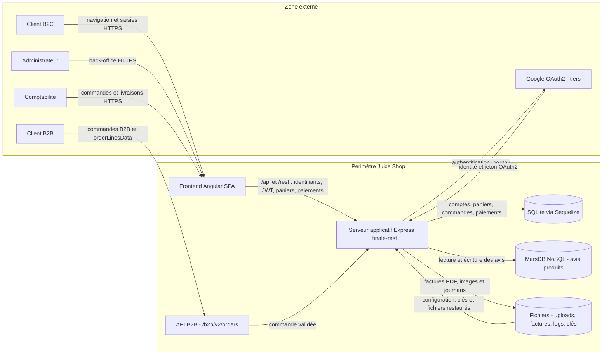

# Threat model - Juice Shop

Ce modèle couvre le fork Juice Shop exécuté comme une application Angular servie par un serveur Node.js/Express. Il reprend les biens essentiels et les événements redoutés définis dans [`contexte.md`](./contexte.md). Juice Shop étant volontairement vulnérable, les faiblesses décrites ci-dessous sont analysées comme si l'application devait être exploitée en production.

## 1. Contexte et biens essentiels

| Bien essentiel | Pourquoi il compte | Événement redouté (EBIOS) | Gravité (1 à 4) |
|---|---|---|---|
| BE1 - Comptes clients et données personnelles | Identifier les clients, protéger leur vie privée et respecter le RGPD | ER1 - divulgation de l'ensemble des comptes et données personnelles | 4 |
| BE2 - Commandes et historique d'achat | Matérialiser les ventes et assurer leur traçabilité | ER2 - modification non autorisée de commandes ou de montants | 4 |
| BE3 - Transactions et données liées au paiement | Encaisser correctement et prévenir la fraude | ER2 - modification non autorisée de commandes ou de montants | 4 |
| BE4 - Continuité du service et réputation | Maintenir la vente en ligne et la confiance des clients | ER3 - indisponibilité de la boutique pendant 24 heures | 3 |

## 2. Data flow diagram

Trust boundaries identifiées :

- **TB1 - Réseau public :** entre les navigateurs B2C, administrateur ou comptabilité et l'application. Toute donnée, tout identifiant de ressource et tout jeton reçu du client doivent être considérés comme hostiles.
- **TB2 - Interface B2B :** entre le client B2B et `/b2b/v2/orders`. Les données de commande franchissent une interface exposée et atteignent une logique d'évaluation côté serveur.
- **TB3 - Zone publique et back-office :** les fonctions client, administration et comptabilité partagent le même serveur Express, mais doivent rester séparées par des contrôles de rôle (`isAuthorized`, `isAccounting`, `denyAll`).
- **TB4 - Stockages :** entre Express et SQLite, MarsDB et le système de fichiers. Les données persistées ne doivent être accessibles qu'au travers de règles d'autorisation et de validation côté serveur.
- **TB5 - Service tiers :** entre Express et Google OAuth2, hors du périmètre maîtrisé. Les jetons et réponses du tiers doivent être authentifiés et validés.

## 3. Analyse STRIDE

| # | Élément / flux | Catégorie STRIDE | Menace concrète | Exigence de sécurité | Priorité (H/M/L) |
|---|---|---|---|---|---|

## 4. Correspondance avec EBIOS RM

| Menace STRIDE (ligne) | Événement redouté associé | Scénario de risque (source -> chemin -> impact) |
|---|---|---|

## 5. Suivi

Les exigences de priorité H seront rattachées aux contrôles automatisés des séances 3 à 5, à un finding d'audit de la séance 8 ou au plan de remédiation de la séance 9.
