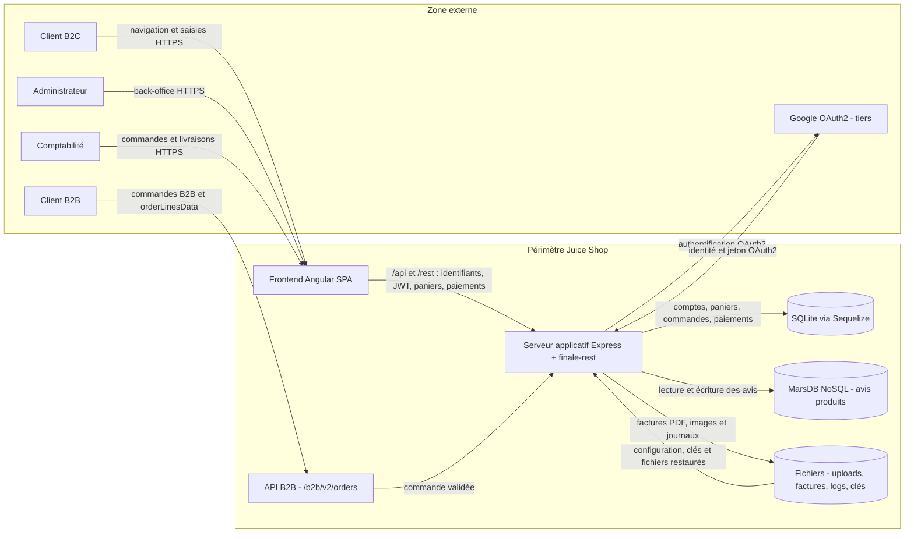

# Threat model - Juice Shop

Ce modèle couvre le fork Juice Shop exécuté comme une application Angular servie par un serveur Node.js/Express. Il reprend les biens essentiels et les événements redoutés définis dans [`contexte.md`](./contexte.md). Juice Shop étant volontairement vulnérable, les faiblesses décrites ci-dessous sont analysées comme si l'application devait être exploitée en production.

## 1. Contexte et biens essentiels

| Bien essentiel | Pourquoi il compte | Événement redouté (EBIOS) | Gravité (1 à 4) |
|---|---|---|---|
| BE1 - Comptes clients et données personnelles | Identifier les clients, protéger leur vie privée et respecter le RGPD | ER1 - divulgation de l'ensemble des comptes et données personnelles | 4 |
| BE2 - Commandes et historique d'achat | Matérialiser les ventes et assurer leur traçabilité | ER2 - modification non autorisée de commandes ou de montants | 4 |
| BE3 - Transactions et données liées au paiement | Encaisser correctement et prévenir la fraude | ER2 - modification non autorisée de commandes ou de montants | 4 |
| BE4 - Continuité du service et réputation | Maintenir la vente en ligne et la confiance des clients | ER3 - indisponibilité de la boutique pendant 24 heures | 3 |

## 2. Data flow diagram

Trust boundaries identifiées :

- **TB1 - Réseau public :** entre les navigateurs B2C, administrateur ou comptabilité et l'application. Toute donnée, tout identifiant de ressource et tout jeton reçu du client doivent être considérés comme hostiles.
- **TB2 - Interface B2B :** entre le client B2B et `/b2b/v2/orders`. Les données de commande franchissent une interface exposée et atteignent une logique d'évaluation côté serveur.
- **TB3 - Zone publique et back-office :** les fonctions client, administration et comptabilité partagent le même serveur Express, mais doivent rester séparées par des contrôles de rôle (`isAuthorized`, `isAccounting`, `denyAll`).
- **TB4 - Stockages :** entre Express et SQLite, MarsDB et le système de fichiers. Les données persistées ne doivent être accessibles qu'au travers de règles d'autorisation et de validation côté serveur.
- **TB5 - Service tiers :** entre Express et Google OAuth2, hors du périmètre maîtrisé. Les jetons et réponses du tiers doivent être authentifiés et validés.

## 3. Analyse STRIDE

| # | Élément / flux | Catégorie STRIDE | Menace concrète | Exigence de sécurité | Priorité (H/M/L) |
|---|---|---|---|---|---|
| 1 | Jetons JWT entre le client et Express | Spoofing | La clé privée RSA est embarquée dans `lib/insecurity.ts` et sert à signer les jetons pendant 6 h. Une personne qui obtient le code peut fabriquer un jeton et usurper un client, un administrateur ou un comptable. | **EX-01 :** stocker la clé privée dans un gestionnaire de secrets, utiliser une clé propre à chaque environnement, prévoir rotation et révocation et réduire la durée de vie des jetons. | H |
| 2 | Cookies de session | Spoofing | `server.ts` initialise `cookieParser` avec le secret constant `kekse`. La connaissance de ce secret permet de fabriquer des cookies signés acceptables lorsque cette signature est utilisée. | **EX-02 :** générer un secret aléatoire hors du dépôt, le charger depuis un gestionnaire de secrets et activer `Secure`, `HttpOnly` et `SameSite` sur les cookies sensibles. | M |
| 3 | `GET /rest/basket/:id` et panier SQLite | Tampering | `routes/basket.ts` recherche directement le panier avec l'identifiant fourni dans l'URL. `isAuthorized()` vérifie seulement le JWT et aucun rejet ne compare `:id` au panier du porteur : un client authentifié peut consulter ou cibler le panier d'un autre client. | **EX-03 :** effectuer un contrôle d'appartenance serveur sur chaque lecture ou modification de panier et dériver l'identifiant du panier depuis l'identité authentifiée. | H |
| 4 | Réponses HTTP et appels navigateur vers API | Information disclosure | `server.ts` applique `cors()` à toutes les origines et seulement une partie des protections Helmet, sans CSP. Un site hostile dispose d'une surface accrue pour appeler l'API et exploiter une injection côté navigateur. | **EX-04 :** limiter CORS aux origines nécessaires et définir CSP, HSTS et les en-têtes de sécurité adaptés. | M |
| 5 | Table `Users` dans SQLite | Information disclosure | `models/user.ts` appelle `security.hash()` pour les mots de passe ; cette fonction utilise MD5 sans sel dans `lib/insecurity.ts`. Après une extraction de la base, des mots de passe faibles peuvent être retrouvés rapidement. | **EX-05 :** hacher les mots de passe avec Argon2id ou bcrypt, avec sel unique et paramètres de coût adaptés, puis migrer les empreintes existantes. | H |
| 6 | `GET /metrics` | Information disclosure | `server.ts` expose `/metrics` sans authentification avant le catch-all Angular ; `routes/metrics.ts` publie notamment des informations de fonctionnement et des nombres d'utilisateurs par rôle utiles à la reconnaissance. | **EX-06 :** isoler les métriques sur un réseau d'administration, imposer une authentification et supprimer les données métier non nécessaires. | M |
| 7 | `/ftp`, `/support/logs` et `/encryptionkeys` | Information disclosure | `server.ts` active `serve-index` et le téléchargement sur ces répertoires. Un visiteur peut énumérer des sauvegardes, journaux ou clés publiques et récupérer des informations facilitant une attaque ou contenant des données sensibles. | **EX-07 :** désactiver l'indexation, appliquer une liste blanche stricte des fichiers publiables et protéger les journaux et clés par authentification et séparation de stockage. | H |
| 8 | Actions d'administration et de comptabilité | Repudiation | Le journal `morgan` trace les requêtes HTTP dans `logs/`, mais aucun journal d'audit dédié ne relie de façon fiable une action sensible à une identité, un résultat et un horodatage protégé. Un acteur interne peut contester une modification. | **EX-08 :** produire un journal d'audit append-only pour les actions sensibles avec identité, action, cible, résultat, horodatage et corrélation, puis surveiller son intégrité. | M |
| 9 | `POST /rest/user/reset-password` | Denial of service | Le limiteur de `server.ts` utilise en priorité l'en-tête client `X-Forwarded-For` comme clé. Un attaquant peut faire varier cet en-tête, contourner la limite et multiplier les demandes ou les essais. | **EX-09 :** n'accepter les en-têtes proxy que depuis des proxys de confiance et limiter par compte et par adresse vérifiée, avec temporisation progressive et supervision. | M |
| 10 | `POST /b2b/v2/orders` | Denial of service | `routes/b2bOrder.ts` évalue `orderLinesData` contrôlé par le client. Le délai de 2 s borne une requête, mais des évaluations coûteuses parallèles peuvent monopoliser les ressources du processus Express. | **EX-10 :** remplacer l'évaluation par un format de données validé par schéma, limiter taille, complexité et concurrence et appliquer un quota global à l'API B2B. | H |
| 11 | `POST /api/Users` vers le modèle `User` | Elevation of privilege | Le champ `role` du corps est accepté par le modèle `models/user.ts`, qui autorise notamment `admin`. Un visiteur peut demander un rôle privilégié lors de son inscription. | **EX-11 :** utiliser une liste blanche de champs d'inscription et imposer le rôle `customer` côté serveur ; réserver les changements de rôle à une fonction d'administration auditée. | H |
| 12 | Endpoints métier protégés par `isAuthorized()` | Elevation of privilege | `isAuthorized()` dans `lib/insecurity.ts` valide la signature du jeton sans contrôler le rôle. Par exemple, `POST /api/Products` est accessible à tout utilisateur authentifié dans `server.ts`, ce qui permet à un client d'exécuter une opération administrative. | **EX-12 :** appliquer un RBAC serveur avec refus par défaut et vérifier le rôle ou la permission précise sur chaque endpoint sensible. | H |
| 13 | Upload XML via `POST /file-upload` | Information disclosure | `lib/xml.ts` active le chargement des DTD, la substitution d'entités et l'accès au système de fichiers. Un fichier XML hostile peut donc lire un fichier local par XXE malgré les limites de taille et de temps. | **EX-13 :** désactiver DTD et entités externes, utiliser un parseur XML configuré en mode sûr et tester automatiquement les charges XXE. | H |

## 4. Correspondance avec EBIOS RM

| Menace STRIDE (ligne) | Événement redouté associé | Scénario de risque (source -> chemin -> impact) |
|---|---|---|

## 5. Suivi

Les exigences de priorité H seront rattachées aux contrôles automatisés des séances 3 à 5, à un finding d'audit de la séance 8 ou au plan de remédiation de la séance 9.
